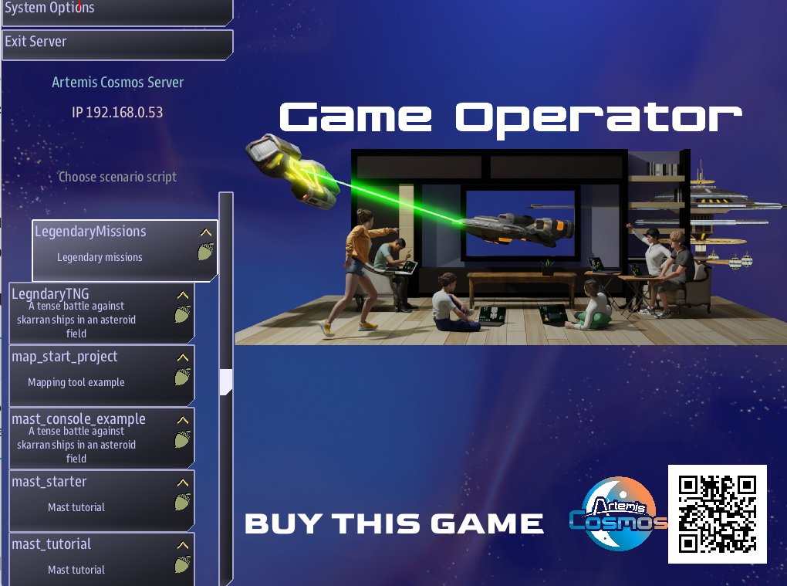
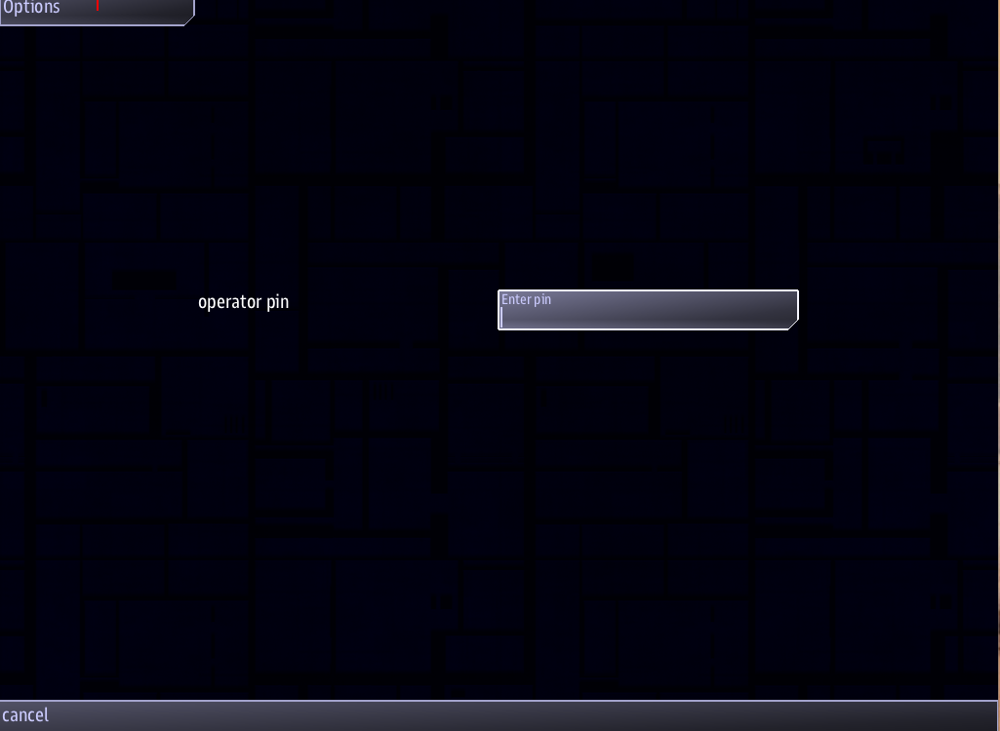
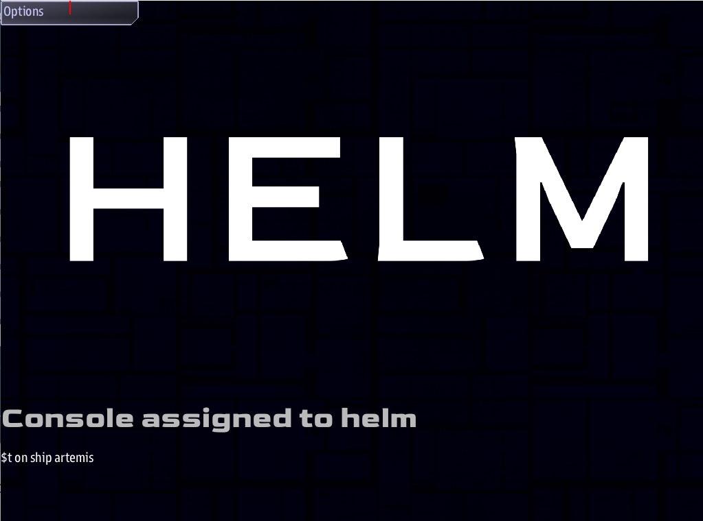

# Remote server Hosting, Operator tools and Console locking

The Legendary Missions can be configured to help automate startup, tools to help those having remote severs and/or running Artemis Cosmos in a virtual machine.

There are also tools to help Operators have a consistent and quick start up  process to help their running at conventions go more smoothly.

Console Locking helps anyone with a Bridge and desires to lock the client console PCs to specific consoles.

## Remote server tools
Those Running Artemis Cosmos on a remote server can run Artemis Cosmos in a manner that allows them to not always require a Remote Desktop link to start and run games.

While not truly a headless server it should reduce the number of times needed to remote in.

### Artemis Cosmos: Nearly headless mode

When running a Artemis Cosmos Server in some scenarios e.g. cloud based servers, it is often desired run in a headless mode.

Artemis Cosmos still runs in a graphical manner, however there are now options to simplify the running a remote server.

### Preference: default_mission_folder
In the Artemis Cosmos data directory there is a file *preferences.json". In this file there is a setting to automatically start a mission when the artemis executable runs: default_mission_folder.

By uncommenting and setting this value it will run in server mode the specified mission.

For example:

``` ini
"default_mission_folder":  "LegendaryMissions"
```

Will run the the Legendary Mission on startup.

### Remote mission picker
There is also a mission script to present the mission picker remotely.

If you do not have it, it can be obtained my opening a command line in the missions folder and typing:

``` cmd
.\fetch artemis-sbs remote_mission_pick
```

You must have an internet connection for this. The fetch command retrieves missions from github.

Alternatively you can get the mission from github.

[Mission on github](https://github.com/artemis-sbs/remote_mission_pick)


## Operator Tools

The operator tools include:

- time limit and setup.json
- default mission
- Enable Operator mode
- Main screen Operator logo
- An Operator console
- Operator Console commands

### time limit and setup.json

The time limit setting is available for missions, but operators in particular may want to set this setting in setup.json to a specific value to avoid retyping it all the time.

``` json
    GAME_TIME_LIMIT: true
```

In general the setup.json is useful for setting things up to avoid constantly tuning the setting each run. Should be useful for operators.

[see here ](setup.json.md) for what settings Operators may want to tweak.

!!! tip "Different defaults"

    Operators that want different setups for varied crews, could copy the mission and alter the setup.json. While this takes up more space, It could be a time saver. This only needs to be don on the server.


### Default mission
Look above for setting the default Mission Folder. This will help run your most common mission e.g. Legendary Missions.

It won't prevent you from later selecting other missions.


### Enabling Operator mode setting
The Legendary Missions and mission that leverage the operator Addon have a setup.json file. This file can set the default starting values as well as enable operator mode.

To enable operator mode, set the OPERATOR_MODE enable to true.

With operator mode turned on, a client console can act as the mission startup settings screen and it also has some useful things for operators.

``` json
"OPERATOR_MODE": {
        "enable": true,
        "logo": "media/operator",
        "show_logo_on_main": true,
        "pin": "000000"
    },
```

### Main screen Operator logo
The main screen is the first thing most player will see and can look at while they wait for the game to start.

The Operator logo is an image the Operator can control and replace to have whatever content they would like on the main screen prior to the game starting.

Three setting effect this first operator mode needs to be enabled in all missions setup.json that this is desired in.
Next *show_logo_on_main* needs to be set to true. Then *logo* should be the png folder and name for what file is desired.

The logo name should not have the .png extension, and only png files are supported.
The logo file currently need to be in every mission you would like to have Operator mode logo work.

``` json
"OPERATOR_MODE": {
        "enable": true,
        "logo": "media/operator",
        "show_logo_on_main": true,
        "pin": "000000"
    },
```




### Operator Admin Console

By enabling OPERATOR_MODE a new console will show up in the client selection screen.

The operator console is used to start the game and manage the game while it is running.

First thing the Operator Admin console can require a pin to limit access to it. This pin is set in setup.json on the server.



Selecting the Operator Admin Console will first present a pin input screen. Successful pin entry will go to the Operator screen.

Prior to the start of the game the Operator console displays. The Start up options regardless of the show_logo_on_main setting.

??? Note

    Changing setting on the main screen and the Operator screen may not be reflected on both.

### Operator Console commands

Once the game is started the Operator console changes to a screen similar to the Game master or Admiral consoles.
It provides additional information such as Time remaining and how many raiders are remaining.


Like the Game master and Admiral console, there are commands for the operator. These include:

- Game
    - Pause Game
    - End Game
- Game Time
    - Add 1 Minute
    - Add 10 Minutes
    - Subtract 1 Minute
    - Subtract 10 minutes


## Client station locking

- console_mode
- Client station pre game images


If you desire you console PCs to be locked to a specific console. This can be accomplished.

For example, you have a PC you want to be helm and do not want players changing the console.

This is accomplished by setting values **on the client pc**.

### console_mode

The client PC will have a *client_strings.txt* file. Editing this file and adding the key **console_mode** and the value for what console and what ship to assign the client to.

The console should be one of:

- helm
- weapons
- engineering
- comms
- science
- mainscreen
- cinematic
- hangar
- admin
- admiral

The value needs to include the ship to assign them to. The ship name must be a ship created by the mission typically this one in setup.json

The console type and ship are separated by a semi colon

```
console_mode
helm;artemis
```

A locked console should no longer present a console selection screen , but instead show an image. 

Additional consoles can also be supported. Any console defined with  @console can be used as a console type.




### Client station pre game images

When the console_mode is set, the console selection selection screen in not shown instead and image is shown.

In fact, this can be a slideshow of images.

These image file currently need to be in every mission you would like to have console_mode to present images.

The image files need to be in a folder matching the console id in the media folder of the mission. e.g. *media/helm/image1.png*

For a slide show place several images in the folder. The system will load all png files in the folder present them in alphabetical order. Images will rotate about every 10 seconds.

!!! Note "Numeric ordering"

    Because it is 'alphabetic' image10.png will sort before image2.png. So it may be better to name image02.png, etc. instead.

