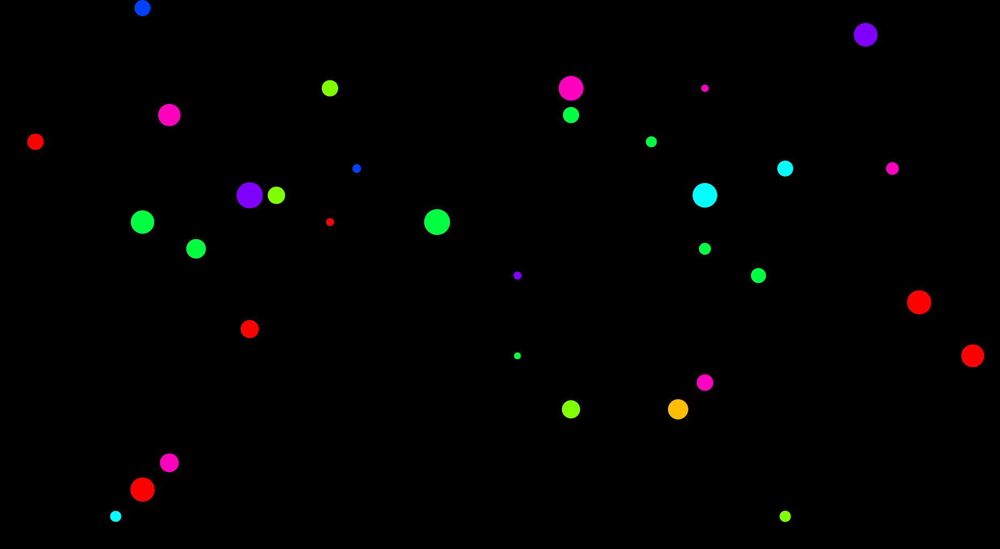
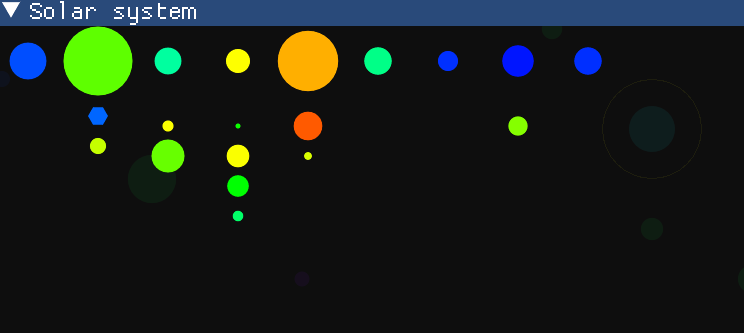

# New Map system post 1.0
This will use a system of grids and tiles.

## Layers, Tilemap grids and tiles
The system uses concepts of:

- Layers
- Tile map Grids
- tile indicators
- Tiles

Layers define grids and tiles specific to that layer.
grids are a 2 dimensional array of indicators
indicators define an abstract of what type of tile is in a grid location
tiles define the concrete details of the contents of a grid location

Tiles are typically define a new layer. 

### Easy grid scripting
Inspired by how retro game scripting define sprites. The system supports a simple string grid to define the grid.

For example, this defines a small galaxy with 3 star systems.

```
//tile/galaxy

label grid= """
........s...
...s........
........s...
"""

```


## Layers of tilemap grids

- Galaxy layer (abstract size)
- Star system layer (abstract size)
- planetary layer (1Mx1M)
- Satellite layer (100kx100k) 
- Sector layer (10kx10k)
- Object layer (1kx1k)

- galaxy systems pesudo endless grid or defined grid
    - star system indicators
    - dead space

- star system of grid of star system tiles no scale/distance implied by grid
    - star indicators
    - planetary indicators

These will have actual distances and will be in engine

- planetary systems are 1Mx1M with 100kx100k satellite indicators
    - moon 
    - settlements (Better name?)
    - dead space (Empty/light terrain)

- settlement satellites are 100kx100k with 10kx10k sector tiles
    - sector tiles
        - terrain tiles
        - station tiles
    
- sectors systems are 10kx10k (1kx1k tiles ?)
    - station actual placement
    - mines
    - terrain
    - ship tiles
        - fleet tiles
        - npc tiles
        - player tiles


## Galaxy level
The galaxy is a grid representing a grid items is either a star system or dead space

By default the galaxy will just be an 'endless' grid generated by seeded random numbers.



### user defined galaxy
A galaxy can be defined with a galaxy tile

```
//tile/galaxy

label grid ="""
........s...
...s........
........s...
"""
```

## star system tiles generation rules

start systems is sized based on the number of stars an the max number of planets.

2*max_planet x (number_of suns+1)/2

so if you have 3 suns, with 8, 11, 15 planets
the grid is 30 x 4

Conceptually this ia a 30Mm x 4Mm, but orbit diameters can be depicted differently as the grids are ,ore about the count than actual distance. 



- A star system indicators specifies the number of star section tiles . Think of it a as deck of cards with:
    - one-3 stars tiles are star being 500k - 1M in diameter cards
    - 7-15 planetary systems cards
    - with 83 - 93 dead space cards
    - it is not meant to make orbital sense

These cards are 'shuffled' and fill in the grid.
This can be done is a seeded pseudo random fashion so random, but repeatable if desired

It would be nice if the stars where visible in the sky box.
You can not travel to a star it is sure death.

### User defined star system tiles

digits specify stars
alpha specifies planetary systems

this is a 15x10 example for simplicity, but  galaxies can be sized in a rectangular grid

```
//tile/star/milk

label grid = """
..c............
..1..a.........
..b............
...............
..........d....
........g..2.e.
.........f.....
.h.............
..3.i..........
...............
"""

match TILE.code:
    case "a":
        TILE_OBJ.name = "Earth"

--- some_logic
# These are labels and can define logic

```


## A planetary system
A planetary system is 1Mmx1Mm or 100 satellite tiles 100kx100k

A generated planetary system is randomized in the follow manner.

- A satellite system Tile specifies the type of tile to place. 
    - m+M one-4 moon tiles,  moons being 50k - 100k in diameter 
    - e+E one-7 celestial event tiles, black hole etc. 50k - 100k in diameter
    - c+C - 7 - 15 colonies
    - The rest are terrain cards, dead space, asteroids, pickups, etc
    - digit means a user defined tile
    - it is not meant to make orbital sense

### User defined planetary system

```

//tile/planet "Keplar"

label grid ="""
.......e..
.s........
..T.::.T..
....::T.s.
...1......
..e.:..T..
..TT......
..s.T..T..
.....T.s..
...::::...
1=tile/satellite/beachwood
"""

#
# 
#

```


## A satellite system
A satellite system is 100kx100k or 100 10kx10k grid of 10K orbital system tiles

A generated satellite system is randomized in the follow manner.

- A orbital system Tile specifies the type of tile to place. 
    - e+E one-7 celestial event tiles, black hole etc. 5k - 10k in diameter
    - s+S 7-15 station cards
    - f+F 1-3 FTL tiles JUmp gates and other FTL constructs
    - with 71 - 90 terrain cards, dead space, asteroids, pickups, etc
    - digit means a user defined tile
    - it is not meant to make orbital sense

A star system contains the number of 'planets' and the number of stations and moons around a planet

### User defined planetary system


```

//tile/satelite "Keplar"

label grid ="""
......e..
.s..f.....
..T.::.T..
....::T.s.
...1......
..e.:..T..
..TT.m....
..s.T..T..
...F.T.s..
...::::...
1=tile/sector/beachwood_station
"""

#
# 
#

```


### Sector tiles


```
//tile/sector/beachwood_station "Command Station" if tile_opts.is_friendly

label grid ="""
:aA.A.:...
A:...:....
.a........
.......p..
..:mmm:...
..m.s.m:..
......:...
:.........
:::.....::
::::...:::
s=name:Beachwood Station;artid:starbase_command;side=tsn;
"""

#
# 
#

```


### Scripted tiles

```
//tile/sector/station "Io"
npc_spawn(...)

```


### Blackhole and moon
Blackhole and moons can be can be scripted 


```
//tile/sector/black_hole "Black Hole"
#
# Completely scripted tile
#
x = TILE.pos.x
y = TILE.pos.y
z = TILE.pos.z

_prefix = "XEA"

bh_name_number = get_inventory_value(SHARED, "bh_name_number", 0)
r_name = f"{random.choice(_prefix)} {str(call_signs[bh_name_number]).zfill(2)}"
bh_name_number = (enemy_name_number+1)%99
set_inventory_value(SHARED, "bh_name_number", bh_name_number)

bh = to_object(terrain_spawn(x,y,z, r_name, "#,black_hole", "maelstrom", "behav_maelstrom"))
bh.engine_object.exclusion_radius = 100 # event horizon
blob = bh.data_set
blob.set("gravity_radius", gravity_radius, 0)
blob.set("gravity_strength", gravity_strength, 0)
blob.set("turbulence_strength", turbulence_strength, 0)
blob.set("collision_damage", collision_damage, 0)

```


## Fleet tiles
Used for defining fleets
an update to the current tables

```

//tile/fleet if tile_opts.DIFFICULTY==5

label grid ="""
..........
..........
..........
....a.....
...b.b....
..c.c.c...
...d.e....
..........
..........
..........
e=tile:npc/wolf_spider;
"""
#
# * denotes defaults if not specified
#
TILE.OBJ.side=tsn
TILE.OBJ.artid = "tsn_escort"
if TILE.code == "a":
    TITLE.OBJ.artid = "tsn_destroyer"

if TILE.code == "a":
    TITLE.OBJ.artid = "tsn_destroyer"

if TILE.code == "a":
    TITLE.OBJ.artid = "tsn_lightcrusier"

#
# These are still labels and 
# they run after a tile is spawned 
#
some_value = 5

--- fleet_logic
# this is the brain logic
# Default keeps formation?

jump fleet_logic

```

### NPC tile
Ideal for creating story character NPC

```
//tile/npc/wolf_spider "Wolf Spider"
"npc=name:intrepid;artid:tsn_lightcrusier;
#
# These are still labels and 
# they run after a tile is spawned 
#
some_value = 5

--- story_logic

... etc ...

```

# Tiles al the way down


```
#
# The default label for a planetary code s
# 
#
//tile/sector/s 

````
